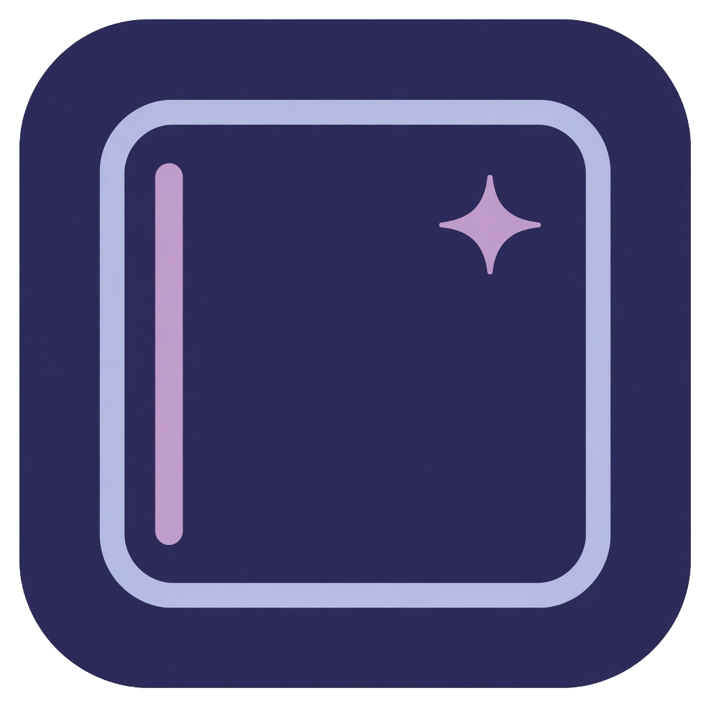
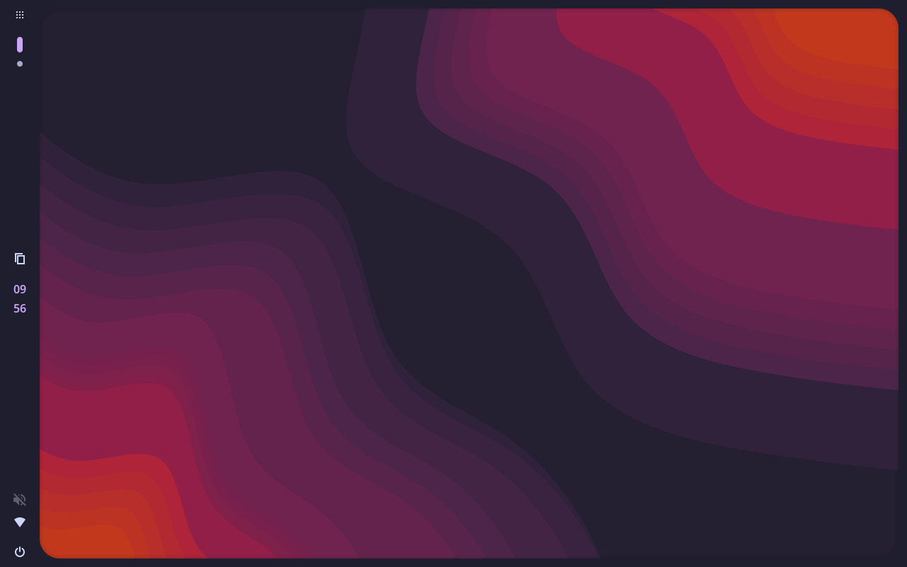
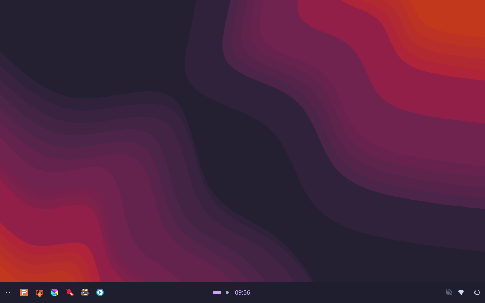
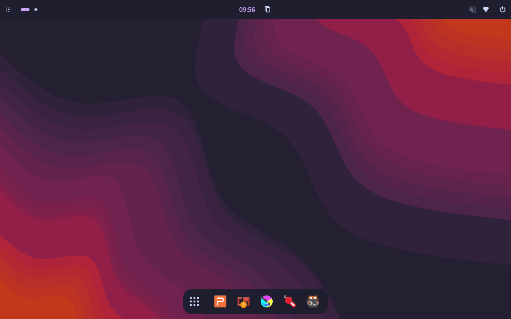
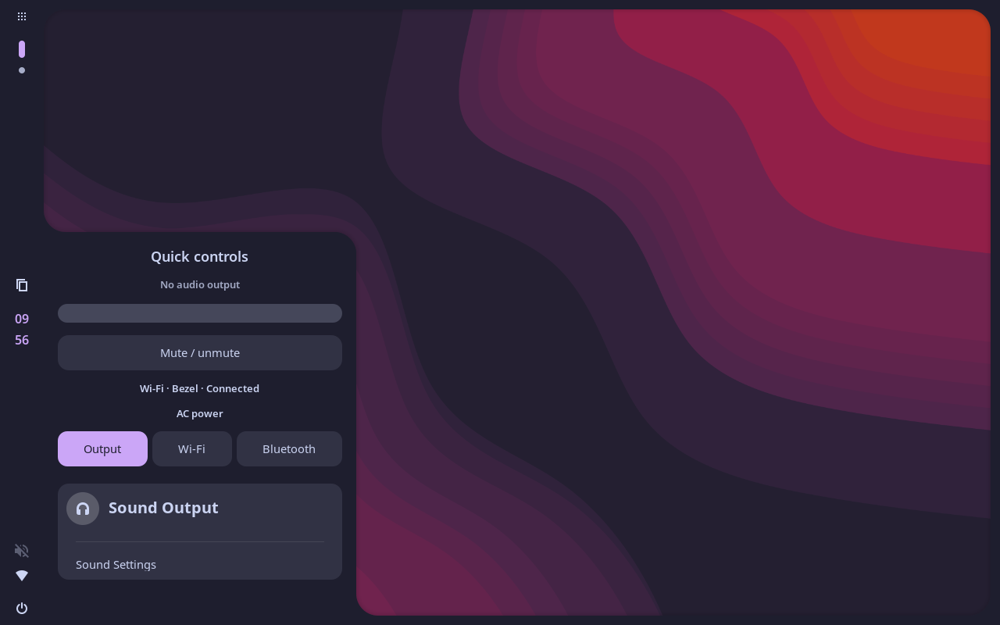
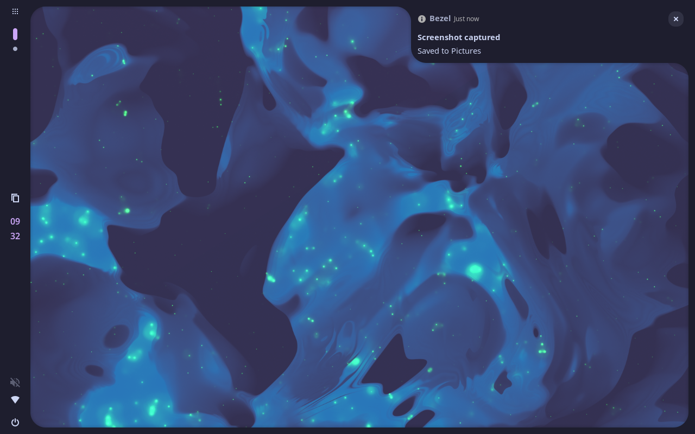
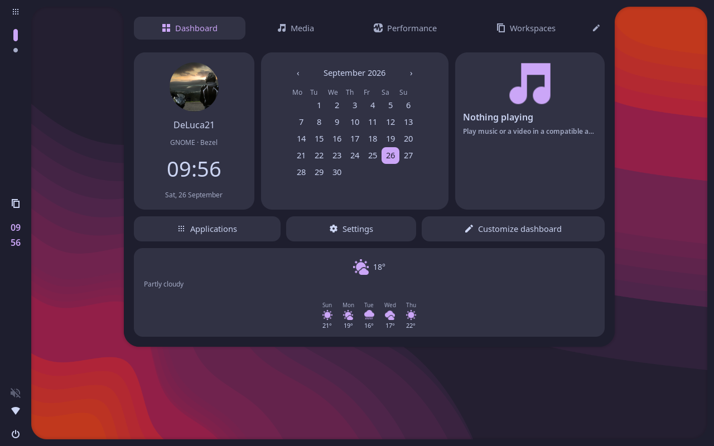

# Bezel

[](https://www.gnome.org)
[](https://github.com/DeLuca21/Bezel/blob/master/bezel@deluca21/metadata.json)
[](https://github.com/DeLuca21/Bezel/issues)


---

<p align="center">
  
</p>
<p align="center">
  A Caelestia-inspired shell for GNOME: one rounded frame, your own bars and docks, and drawers that join the desktop.
</p>
<p align="center">
  <a href="https://ko-fi.com/DeLuca21" target="_blank">
    
  </a>
  <a href="https://buymeacoffee.com/DeLuca21" target="_blank">
    
  </a>
</p>

---

Bezel draws panels, docks, and popouts over GNOME Shell. Workspaces, apps, audio, session actions, and window space stay GNOME’s. The look is inspired by [Caelestia](https://github.com/caelestia-dots/shell).

---

## ✨ Features

- **Desktop frame** with a rounded opening, drawer joins, and a shadow that follows the palette.
- **Layouts** for a left rail, a bottom panel, a dock, or a top bar plus dock. Save your own and undo a preset.
- **Bars and docks** on any edge, floating or reserved, with pins, running apps, and modules you can reorder.
- **Launcher** on Super+Space. Fuzzy-search apps, open windows, Bezel settings, themes and layouts. Visible Actions (`>`), Files (`/`), Web (`?`) and Commands (`$`) modes also support file paths, URLs, calculations, conversions and web bangs such as `!g` and `!yt`. Existing apps switch to their latest window; New window is a separate action.
- **App feedback** per bar: highlight, lift or both on hover, optional press animation, and separate running/focused indicators.
- **Quick controls** for volume, network, and Bluetooth, using GNOME’s own device lists.
- **Dashboard** for the calendar, media, performance, and workspaces.
- **Extension icons** hosted on a Bezel bar, with size, spacing, and order.
- **Palettes** including Catppuccin, Rosé Pine, Nord, Bezel’s own colours, a custom palette, and colours derived automatically from your wallpaper.

---

## 📸 Screenshots

<p align="center">
  
</p>

<p align="center">
  <br>
  <sub>Bezel</sub>
</p>

<p align="center">
  <br>
  <sub>Panel</sub>
</p>

<p align="center">
  <br>
  <sub>Top bar and dock</sub>
</p>

<p align="center">
  <br>
  <sub>Quick controls</sub>
</p>

<p align="center">
  <br>
  <sub>Notification</sub>
</p>

<p align="center">
  <br>
  <sub>Dashboard</sub>
</p>

---

## 📥 Installation

This installs Bezel, and it also replaces a copy that is already installed. Saved bars, pins, and palettes stay in GNOME. Only the extension files are replaced.

```sh
git clone --depth 1 https://github.com/DeLuca21/Bezel.git /tmp/bezel-install
mkdir -p ~/.local/share/gnome-shell/extensions
rm -rf ~/.local/share/gnome-shell/extensions/bezel@deluca21
cp -a /tmp/bezel-install/bezel@deluca21 ~/.local/share/gnome-shell/extensions/
glib-compile-schemas --strict ~/.local/share/gnome-shell/extensions/bezel@deluca21/schemas
rm -rf /tmp/bezel-install
```

Log out and back in. The first time, enable **Bezel** in Extensions. Wayland loads extension JavaScript at login, so an update needs that logout too. About in Bezel settings can run these commands after showing them for confirmation.

---

## 🔧 Preferences

Bezel settings open in a dedicated custom app, from the dashboard, launcher, Extensions app, or a bar’s right-click menu. Its palette, rounded cards and visual editor match Bezel. It runs as a real window with normal stacking, resizing and Super-dragging.

In **Opening & motion > Session animations**, enable login, lock, and unlock independently. All three share the selected animation style and speed. Lock uses a temporary decorative frame over GNOME’s lock screen; unlock reveals the desktop and bars after the lock screen disappears. The new lock and unlock options default to off and respect reduced motion.

In **Opening & motion**, Off, Fade, or Retreat runs for layout, preset, and palette changes. New installs use Retreat at 500 ms. Transitions respect GNOME’s reduced-motion preference.

Preset cards and saved-layout chips sit above an interactive desktop preview and independently scrollable editor. Click a bar to select it, then use Contents, Size & space, or Apps & logo. Modules appear as chips inside sections and groups. Palettes show swatch cards; custom colours use GNOME’s picker. Switching layouts with unsaved changes offers Cancel, Discard, or Save and switch.

In **Appearance > Palette**, choose **Wallpaper** to follow your current background. Pick Automatic or a source swatch, choose muted, vibrant or monochrome colours, and follow the system light/dark style or choose one explicitly. Unreadable backgrounds retain the previous palette. Bars with their own colours keep those overrides.

Right-click a bar for settings, edit mode, panel or dock, floating, autohide, and remove. Edit mode outlines the bars, puts **+** on empty screen edges and on each section, and lets you drag what is already there. Edit mode never opens settings automatically. Right-click a module while editing to remove it, create a group, or move it into an existing group. Groups can contain any modules and empty spaces; removing a group keeps its contents. Resize spaces from their edit menu or click their chip in settings for an exact pixel size. App pins stay on the app’s right-click menu.

Launcher search settings live under **Your shortcuts**: choose a web engine and search folders (separated by semicolons). File search excludes hidden folders and does not descend into symlinks, `node_modules` or `vendor`; each search covers up to six directory levels and 15,000 entries. Use `/claire` or `/ claire` to search filenames in Files mode. A full path such as `/home/jamie/Pictures/` searches that directory directly; use `//name` for an item directly under the filesystem root. Press Shift+Enter for a result’s secondary action. Matching apps show their windows directly underneath; select a window with Up/Down and Enter, or click it. Use the window-count button to expand or collapse the list. Commands run installed programs with arguments from your home folder: Enter uses a terminal, Shift+Enter runs in the background. Shell syntax requires an explicit shell such as `sh -c`.

In **Desktop > Overview background**, choose Off, Dimmed wallpaper, Blurred wallpaper, or Gradient. Wallpaper styles have a dimming control; blur adds a radius control, and the palette gradient has a colour-strength control. The background fills all monitors behind workspace previews, including when a window is fullscreen. Off keeps GNOME’s standard background.

App feedback settings are under the selected bar’s **Apps** tab. Cycle windows is the default for bars without a saved click preference; existing preferences are preserved. Click actions include Cycle windows (focus the app, then cycle on repeated clicks), Minimize / restore (the current workspace’s window group), Activate, and Window list. Focus indicators can combine an accent line and background. Minimise/restore animations target the app’s icon, including after moving a bar. Lift points toward the desktop on each edge and respects GNOME’s motion preference. Applying a layout from the launcher exposes an **Undo layout change** action to restore the previous setup.

---

## 🛠 Issues & Support

- Found a bug? Report it via [GitHub Issues](https://github.com/DeLuca21/Bezel/issues).
- Have a feature request? Feel free to suggest improvements.
- Pull requests are welcome!

---

## ☕ Support the Project

If you enjoy Bezel, consider **supporting development**:

[](https://ko-fi.com/DeLuca21)

[](https://www.buymeacoffee.com/DeLuca21)

---

## Disclaimer

Bezel is not Caelestia, and it is not part of the GNOME project. It is a shell extension that uses GNOME’s own services. Some Caelestia pieces, including its full launcher providers, wallpaper browser, and stacked toasts, are not in this extension.
